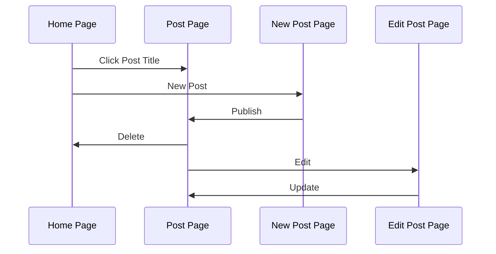

<div align="center">
  <h1>GitHub Issue Blog</h1>

  Use GitHub issue as your blog.

  Example Site: https://github-issue-blog.vercel.app
</div>


## Features

- Use GitHub issues as your blog storage
- Infinite scroll at home page
- Create / Edit / Delete posts
- SEO Friendly
- Light / Dark theme
- RWD
- Comment Section
- Syntax Highlighting


## Get started

1. Fork this repository
2. [Create a GitHub OAuth app](https://docs.github.com/en/apps/oauth-apps/building-oauth-apps/creating-an-oauth-app)

> [!NOTE]
> The OAuth app supports up to [15,000 requests per hour](https://docs.github.com/en/rest/using-the-rest-api/rate-limits-for-the-rest-api?apiVersion=2022-11-28#primary-rate-limit-for-oauth-apps), significantly surpassing the [60 requests per hour](https://docs.github.com/en/rest/using-the-rest-api/rate-limits-for-the-rest-api?apiVersion=2022-11-28#primary-rate-limit-for-unauthenticated-users) limit for unauthenticated requests. This increased capacity enables a higher volume of page views for your site.
3. Customize the blog with following environment variables:

```
GITHUB_CLIENT_ID="your oauth app client id"
GITHUB_CLIENT_SECRET="your oauth app client secret"
AUTHOR_NAME="your name"
BLOG_TITLE="title of your blog"
BLOG_DESCRIPTION="description of your blog"
NEXT_PUBLIC_OWNER="your github username"
NEXT_PUBLIC_REPO="name of your forked repository"
```

If you plan to deploy your site...
- with Vercel: [add environment variables in settings](https://vercel.com/docs/projects/environment-variables)
- by yourself: copy above content to `.env.local`

Make sure you change the value inside `""`.

4. Deploy the site and login to start blogging!
- with Vercel: [follow the docs](https://vercel.com/docs/deployments/overview)
- by yourself: `yarn run build && yarn run start` and check out http://localhost:3000

## Architecture

### Tech Stacks

- Web Framework: [Next.js](https://nextjs.org/) (App Router)
- Language: [TypeScript](https://www.typescriptlang.org/)
- Styling: [Tailwind CSS](https://tailwindcss.com/)
- UI: [Next UI](https://nextui.org/)
  
### Routes

- Home Page: `/`
- Post Page: `/post/{number}`
- New Post Page: `/post/new`
- Edit Post Page: `/post/edit/{number}`



### Folder Structure

- `app/`
  - `page.tsx`: Home Page
  - `[number]/page.tsx`: Post Page
  - `edit/[number]/page.tsx`: Edit Post Page
  - `new/page.tsx`: New Post Page
  - `auth/callback/route.ts`: route handler for GitHub OAuth flow
- `utils/`
  - `post.ts`: fetch posts / post / comments
  - `auth.ts`: fetch user, OAuth utils
  - `octokit.ts`: GitHub OAuth App client
- `actions/`: server actions
  - `post.ts`: create / update / delete post
  - `auth.ts`: login, log out
  - `comment.ts`: create comment
- `hooks/usePosts.ts`: get posts with infinite scroll
- `components/`: UI components
